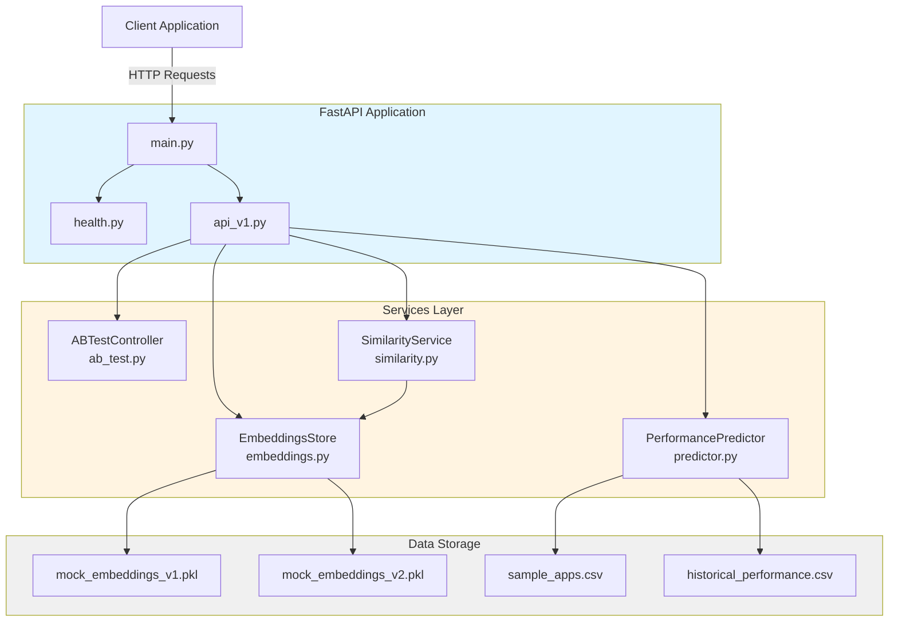
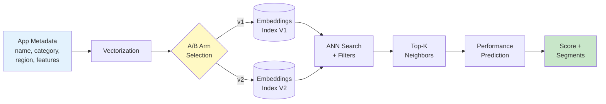

# MobUpps Architecture - Sequence Diagram

```mermaid
sequenceDiagram
    autonumber
    participant C as Client
    participant A as FastAPI (app/main.py)
    participant AB as ABTestController
    participant E as Embeddings
    participant S as Similarity (ANN)
    participant P as Predictor (v1/v2)

    C->>A: POST /find-similar {app, filters, top_k}
    A->>E: derive_or_lookup_embedding(app)
    E-->>A: embedding (v1/v2-capable)
    A->>AB: pick_arm(app_id, partner_id, weights)
    AB-->>A: ab_arm ("v1" | "v2")
    A->>S: topK_neighbors(embedding, k, filters, arm)
    S-->>A: neighbors[]
    A-->>C: 200 {neighbors, ab_arm}

    Note over C,A: שלב שני (חיזוי)
    C->>A: POST /predict {app, neighbors, ab_arm}
    A->>P: predict(app, neighbors, arm)
    P-->>A: {score, segments}
    A-->>C: 200 {ab_arm, prediction}
```

## Component Architecture

```mermaid
graph TB
    Client[Client Application]

    subgraph FastAPI["FastAPI Application"]
        Main[main.py]
        Health[health.py]
        API[api_v1.py]
    end

    subgraph Services["Services Layer"]
        AB[ABTestController<br/>ab_test.py]
        Emb[EmbeddingsStore<br/>embeddings.py]
        Sim[SimilarityService<br/>similarity.py]
        Pred[PerformancePredictor<br/>predictor.py]
    end

    subgraph Data["Data Storage"]
        V1[mock_embeddings_v1.pkl]
        V2[mock_embeddings_v2.pkl]
        Apps[sample_apps.csv]
        Perf[historical_performance.csv]
    end

    Client -->|HTTP Requests| Main
    Main --> Health
    Main --> API
    API --> AB
    API --> Emb
    API --> Sim
    API --> Pred
    Emb --> V1
    Emb --> V2
    Sim --> Emb
    Pred --> Apps
    Pred --> Perf

    style FastAPI fill:#e1f5ff
    style Services fill:#fff4e1
    style Data fill:#f0f0f0
```

## A/B Testing Flow

```mermaid
flowchart TD
    Start([Request Arrives]) --> Extract[Extract partner_id & app_id]
    Extract --> Hash{Sticky Mode?}
    Hash -->|Yes| MD5[MD5 Hash of IDs]
    Hash -->|No| Random[Random Selection]
    MD5 --> Compare{Hash < v1_weight?}
    Random --> Compare2{Random < v1_weight?}
    Compare -->|Yes| V1[Select v1]
    Compare -->|No| V2[Select v2]
    Compare2 -->|Yes| V1
    Compare2 -->|No| V2
    V1 --> LoadV1[Load Embeddings V1]
    V2 --> LoadV2[Load Embeddings V2]
    LoadV1 --> Search[Search Similar Apps]
    LoadV2 --> Search
    Search --> Return([Return Results])

    style V1 fill:#a8e6cf
    style V2 fill:#ffd3b6
    style Start fill:#dcedc1
    style Return fill:#dcedc1
```

## Data Flow

```mermaid
flowchart LR
    Input[App Metadata<br/>name, category,<br/>region, features]

    Input --> Vec[Vectorization]
    Vec --> ArmSelect{A/B Arm<br/>Selection}

    ArmSelect -->|v1| Index1[(Embeddings<br/>Index V1)]
    ArmSelect -->|v2| Index2[(Embeddings<br/>Index V2)]

    Index1 --> ANN[ANN Search<br/>+ Filters]
    Index2 --> ANN

    ANN --> Neighbors[Top-K<br/>Neighbors]
    Neighbors --> Predict[Performance<br/>Prediction]
    Predict --> Output[Score +<br/>Segments]

    style Input fill:#e3f2fd
    style Output fill:#c8e6c9
    style ArmSelect fill:#fff9c4
```
