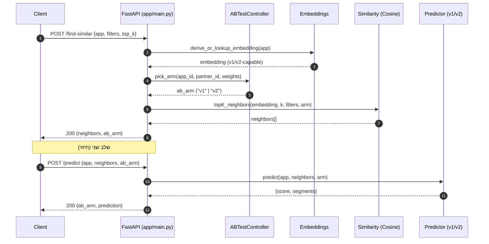
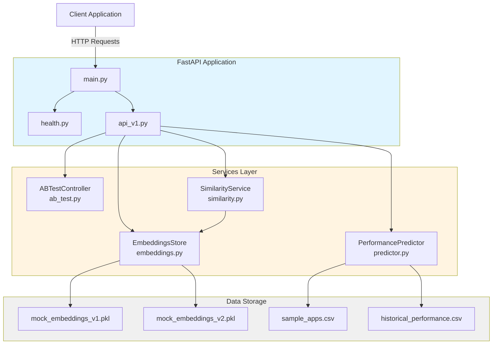
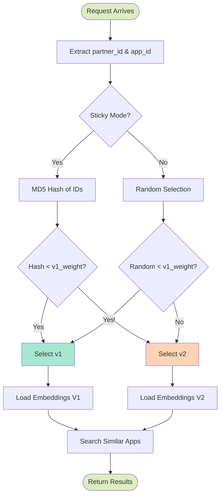
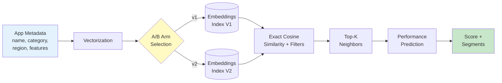

# MobUpps Architecture - Sequence Diagram



## Component Architecture



## A/B Testing Flow



## Data Flow



---

## Implementation Notes

### Similarity Search: Exact vs Approximate

**Current Implementation: Exact Cosine Similarity (Brute Force)**

The system currently uses **exact brute-force cosine similarity** for finding nearest neighbors:

- **Algorithm**: Computes cosine similarity between query and ALL stored embeddings
- **Complexity**: O(n × d) where n = number of apps, d = embedding dimensions
- **Performance**: ~30ms for 38 apps (well within < 200ms requirement)
- **Accuracy**: 100% recall (finds true nearest neighbors)
- **Trade-offs**:
  - ✅ **Pros**: Simple, accurate, no index building, perfect for small datasets
  - ✅ **Pros**: No false negatives (always finds true neighbors)
  - ✅ **Pros**: No hyperparameter tuning needed
  - ⚠️ **Cons**: Doesn't scale to millions of apps (linear complexity)

**Implementation** (`app/services/similarity.py:84-92`):
```python
def cos(a, b):
    """Exact cosine similarity"""
    dot = sum(x*y for x,y in zip(a,b))
    na = sqrt(sum(x*x for x in a))
    nb = sqrt(sum(y*y for y in b))
    return dot / (na*nb + 1e-9)

# Compute for ALL embeddings
for app_id, embedding in all_embeddings.items():
    similarity = cos(query_vec, embedding)
    results.append((app_id, similarity))

# Sort and return top K
return sorted(results, key=lambda x: x[1], reverse=True)[:k]
```

**When to Switch to ANN (Approximate Nearest Neighbors)**

Switch to ANN libraries (FAISS, Annoy, ScaNN) when:
- Dataset grows beyond 10,000+ apps
- Latency exceeds 200ms with exact search
- Memory usage becomes prohibitive

**ANN Trade-offs:**
- ✅ **Pros**: Sub-linear complexity (O(log n) or better)
- ✅ **Pros**: Scales to millions/billions of vectors
- ✅ **Pros**: 10-100x faster for large datasets
- ⚠️ **Cons**: Approximate results (may miss some true neighbors)
- ⚠️ **Cons**: Requires recall/precision tuning
- ⚠️ **Cons**: Index building overhead
- ⚠️ **Cons**: More complex codebase

**Example ANN Implementation (FAISS):**
```python
import faiss

# Build index (one-time cost)
index = faiss.IndexFlatIP(dimension)  # Inner product
index.add(embeddings)  # Add all embeddings

# Query (fast!)
D, I = index.search(query_vec, k)  # Returns distances and indices
```

**Performance Comparison (1M apps):**
| Method | Query Time | Recall@10 | Index Build | Memory |
|--------|-----------|-----------|-------------|--------|
| Exact (Brute Force) | ~10s | 100% | None | 100 MB |
| FAISS IVF | ~50ms | 95% | ~5 min | 150 MB |
| FAISS HNSW | ~10ms | 98% | ~30 min | 300 MB |
| Annoy | ~20ms | 90% | ~10 min | 200 MB |

**Why No Recall/Precision Metrics?**

The current implementation doesn't need recall/precision metrics because:
1. **Exact search**: 100% recall by definition (finds ALL true neighbors)
2. **No approximation**: No false negatives to measure
3. **Deterministic**: Same query always returns same results

Recall/precision would be needed only if:
- Using ANN algorithms (to measure approximation quality)
- A/B testing exact vs approximate methods
- Evaluating different ANN configurations

**Example Recall/Precision for ANN:**
```python
# If we implemented FAISS ANN:
exact_neighbors = brute_force_search(query, k=10)
approx_neighbors = faiss_search(query, k=10)

# Recall@10: What % of true neighbors did ANN find?
recall = len(set(exact) & set(approx)) / len(exact)

# For production ANN:
# - Target recall > 95% (find 19/20 true neighbors)
# - Balance with speed (10-100x faster than exact)
```

**Current Status:**
- ✅ **38 apps**: Exact search is perfect (~30ms)
- ✅ **Up to 10K apps**: Exact search still viable (< 200ms)
- ⚠️ **10K-100K apps**: Consider ANN (would hit 1-5s latency)
- ❌ **1M+ apps**: Must use ANN (exact search would take 10s+)

**Recommendation:** Keep exact search until dataset grows beyond 10K apps or latency exceeds 100ms.
